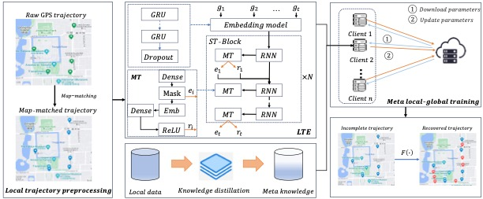
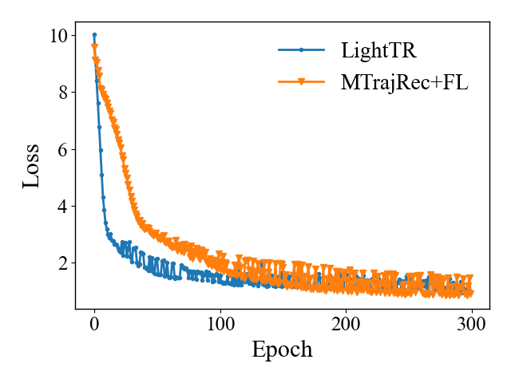

# LightTR （Under Review)

[//]: # (
)

[//]: # ()

[//]: # (
)

## About
Source code of the paper: "LightTR: A Lightweight Framework for Federated Trajectory Recovery"

## Requirements
* `Python==3.6`
* `pytorch==1.7.1`
* `rtree==0.9.4`
* `GDAL==2.3.3`
* `networkx==2.3`

## Usage
#### Dataset
[Geolife](https://www.microsoft.com/en-us/download/details.aspx?id=52367),
[Tdrive](https://www.microsoft.com/en-us/research/publication/t-drive-trajectory-data-sample/)  
We provide sample data under data/.  
Please note that the sample data is preprocessed from the original data above.  
#### Data preprocessing
 For the data preprocessing, please refer to [tptk](https://github.com/sjruan/tptk).

#### Running
  `python federated_main.py --global_epochs 10 --n_clients 10 --threshold 0.5 --lam 1 --keep_ratio 0.125`

## Training convergence curve

